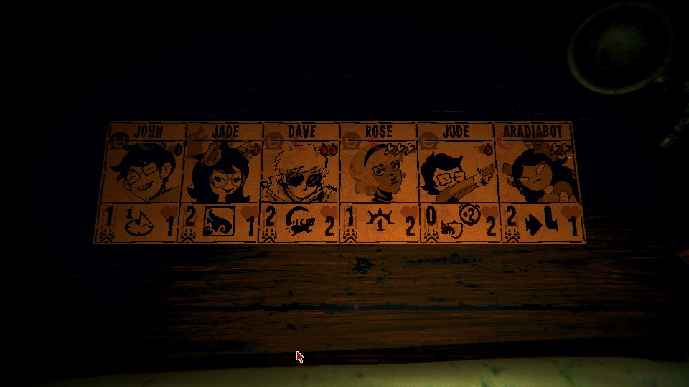

# Homescrypt

This is a card pack for [Inscryption](https://store.steampowered.com/app/1092790/Inscryption/). 
Manage it with the [Pack Management API](https://inscryption.thunderstore.io/package/Infiniscryption/Pack_Management_API/).

It is designed to be played in Kaycee's mod alongside the default beast cards. Variant decks are also available for grimoramod, magmod, and p03 that tweak the sigil and costs appropriately. 

See the full table of cards and their stats in the [csv file](./HS_cards.csv).

Note: Due to a bug in [Infiniscryption Pack Manager](https://github.com/divisionbyz0rro/Infiniscryption), some errors will be logged to console when the "pack art" is generated, complaining about `Parameter name: searchPattern`. This does not indicate a real problem!

## Previews

## Art Credits

Card art based on designs from these wonderful artists:

- John: <https://twitter.com/cursedkendoll>
- June: <https://carcinocasino.tumblr.com>
- Jade: <https://twitter.com/babyfawnlegs>
- Dave: <https://twitter.com/clambuoyance>
- Doomed Dave: TODO
- Rose: <https://twitter.com/cometjynx>
- Dirk: <https://twitter.com/clambuoyance>
- Roxy: https://www.deviantart.com/falthiere
- Jane: <http://omnia-volo.tumblr.com/>
- Jake: jake english_1486371
- Aradia: Unknown!
- Tavros: <https://strovi.neocities.org/>
- Sollux: LOST
- Nepeta: TODO
- Karkat: <https://twitter.com/defunkt_ego>
- Kanaya: itsYerm
- Terezi: <http://ravenswaggered.deviantart.com/>
- Vriska: lichenfiend
- Equius: TODO
- Gamzee: <https://www.instagram.com/p/1y8iIsRnff/>
- Eridan: Unknown!
- Feferi: TODO
- Lil' Hal: <https://twitter.com/dirkdialectic>
- Snowman: MSPA
- Doc Scratch: Gio
- Lord English: <https://homestuck.giovanh.com/homestuck/8087/>
- Crowbar: J.N. Wiedle
- Die: Gio
- MS Paint: indigonite0
- The Condesce: <https://litvac.tumblr.com>
- Jack: TODO
- Calliope: grimbarkjade
